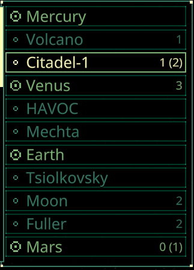

# Quasimorph Mission Expire and Subscription Colors




Adds the following indicators:

Adds a "X (Y)" number to the planet list where X is the non expiring missions and Y is the total number of missions.

Colors the missions as follows:
* Will expire before the ship can travel to the location.
* A subscribed faction is the benefit of the mission.
* Two subscribed factions are attacking each other.
* A subscribed faction is the victim of the mission.

The subscription colors can be disabled and all colors can be customized.

# Upgrade Note
Version 2.0 will not retain the previous configuration changes.
If the old config file format exists, it will be backed up with a .bak extension before being overwritten.

# Configuration
The configuration file is located at ```%UserProfile%\AppData\LocalLow\Magnum Scriptum Ltd\Quasimorph\QM_MissionExpirationHighlight.yaml``` .
The file will be created the first time the game is run.

The `ColorConfig` members contain all of the colors used by the mod.

Set `EnableSubscriptionColors` to false to disable the subscription indicators.

# Issues
Currently the main window does not update when faction subscriptions are changed.  Open and close the star map to refresh the main window.

# Source Code
Source code is available on GitHub https://github.com/NBKRedSpy/QM-MissionExpirationHighlight

# Change Log

## 2.0.0
Added faction subscription colors.
Thanks to Steam user RafaelKB for the suggestion.

## 2.1.0

Fixes:
* Factions subscriptions screen not updating on change.
* Not updating when returning to the main hud.