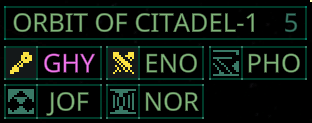

# Quasimorph Show Expiring Missions.



# Info

Adds indictors to the System screen for any missions that will expire before the ship can travel to that location.

Adds a "X (Y)" number to the planet list where X is the non expiring missions and Y is the total number of missions.

The planet details will also color the text for any expiring missions.

The color can be modified in the configuration.


# Configuration
The configuration file is located at ```%UserProfile%\AppData\LocalLow\Magnum Scriptum Ltd\Quasimorph\QM_MissionExpirationHighlight.yaml``` .
The file will be created the first time the game is run.

|Name|Default|Description|
|--|--|--|
|ExpiredMissionColor|#f475ee|The text color for expiring missions.

# Source Code
Source code is available on GitHub https://github.com/NBKRedSpy/QM-MissionExpirationHighlight

