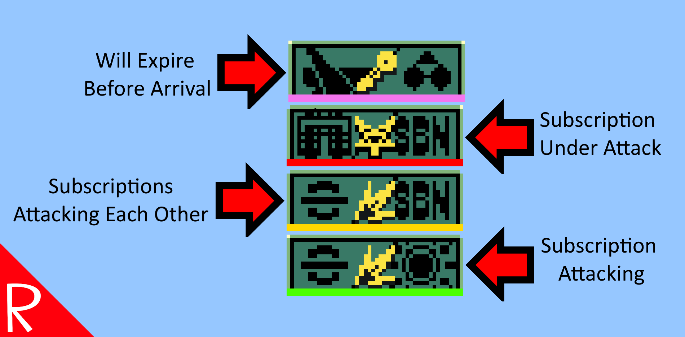

# Quasimorph Mission Expire and Subscription Colors




Adds the following indicators:

Adds a "X (Y)" number to the planet list where X is the non expiring missions and Y is the total number of missions.

Colors the missions as follows:
* Will expire before the ship can travel to the location.
* A subscribed faction is the benefit of the mission.
* Two subscribed factions are attacking each other.
* A subscribed faction is the victim of the mission.

The subscription colors can be disabled and all colors can be customized.

# Configuration
The configuration file is located at ```%UserProfile%\AppData\LocalLow\Magnum Scriptum Ltd\Quasimorph\QM_MissionExpirationHighlight.yaml``` .
The file will be created the first time the game is run.

The `ColorConfig` members contain all of the colors used by the mod.

Set `EnableSubscriptionColors` to false to disable the subscription indicators.

# Support
If you enjoy my mods and want to buy me a coffee, check out my [Ko-Fi](https://ko-fi.com/nbkredspy71915) page.
Thanks!

# Source Code
Source code is available on GitHub https://github.com/NBKRedSpy/QM-MissionExpirationHighlight

# Change Log

## 2.3.0
* Converted to colored bar at bottom of mission.

## 2.2.1
* Incorrect color Fix
* Non primary colors are still difficult to see. 

## 2.2.0
* Preliminary support for .8 as the previous version crashes in .8.  Needs color fixes.

## 2.1.0

Fixes:
* Factions subscriptions screen not updating on change.
* Not updating when returning to the main hud.

## 2.0.0
Added faction subscription colors.
Thanks to Steam user RafaelKB for the suggestion.


